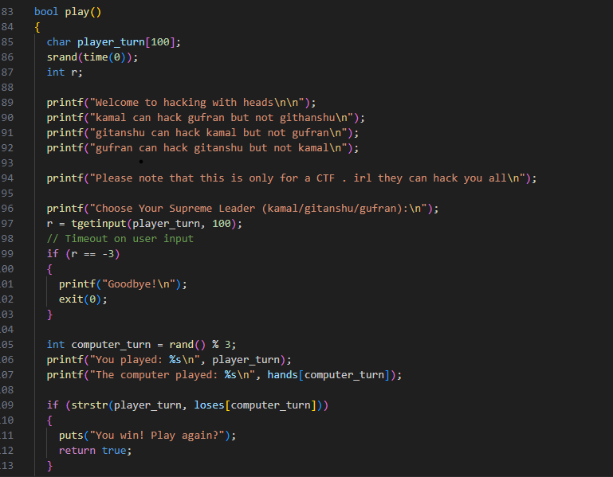
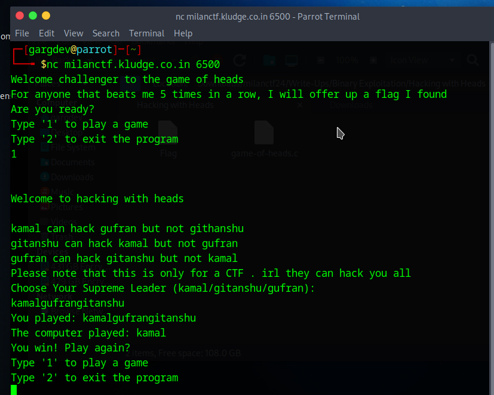
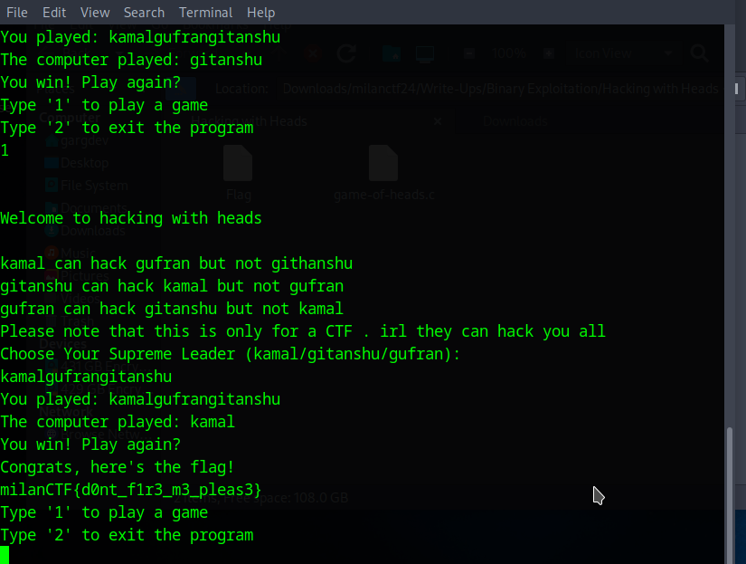

## Hacking with Heads

**Description:** Can you find a way to win. I mean win win.

*nc milanctf.kludge.co.in 6500*

## Required Knowledge
 - strstr() method in C
 - Basic C
 - netcat

## Solution
1. When we connect to the server, it asks us to play the game with it. Where we have to enter either `kamal`, `gufran`, or `gitanshu`. There are some instructions on who can beat who. We need to win 5 times in a row to get the flag but probability of that happening naturally is very low, so we'll try to exploit its logic somehow.

   

2. Now we'll take a look at the code. From the code we see that it uses `strstr()` method to see who wins. This means the instructions on who can beat who doesn't matter, what matters is that your input contains all of their names so that no matter what the computer chooses, your input will contain the `loss[computers_choice]` as a substring.

   

3. You see what I was talking about? Now we just need to repeat this 5 times as per the condition and we'll get our flag.

   

## Flag

`milanCTF{d0nt_f1r3_m3_pleas3}`
