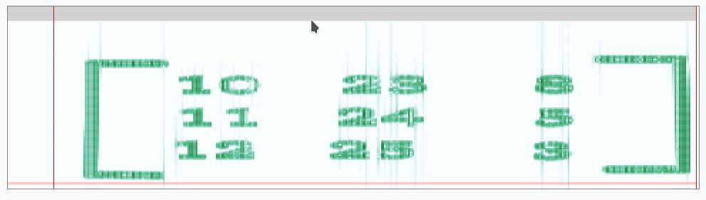

## Echoes From The Hill

**Description:** A strange intercepted audio file that sounds like aliens, but there's more than meets the ear. Hidden within the sound waves lies the key to decrypt the message and claim your flag. Complete the final flag in the format milanCTF{}. See you across the hill!

**Attachments:** cipher.txt and key.wav

## Required Knowledge
 - Spectrogram
 - Cryptography

## Solution
1. We're provided with a text file named `cipher.txt` and an audio file named `key.wav` and we need to decrypt the cipher to find the flag. From the names, we can tell that the audio file will somehow lead us to the key to break this cipher. So first thing we need to do whenever there is an audio file is to get its spectrogram.

   

2. From the spectrogram, we get something like a matrix. The title including the word *Hill* and getting a matrix as the key points us to only one thing, that this was encrypted using *Hill cipher*. So we put the cipher text and the matrix in the hill cipher decoder and we get `MILANCTF_BE_RUNNING_UP_THAT_HILL_`. We know the format of flag, so we can format this result accordingly to get the actual flag.

## Flag

`milanCTF{be_running_ip_that_hill}`
