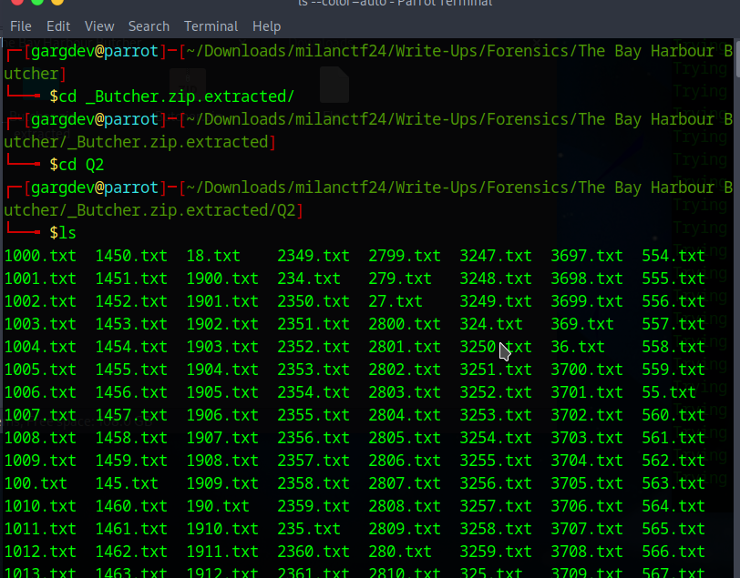
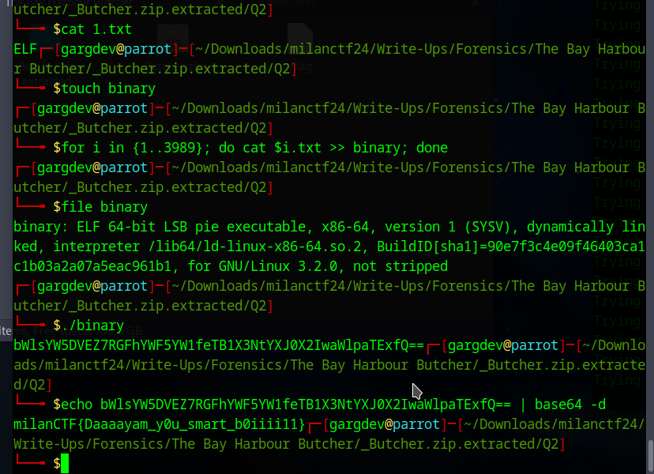

## The Bay Harbour Butcher

**Description:** Do you know about Bay Harbour Butcher? I am a detective from Miami Metro PD, trying to track him down. He left some random files on my PC as a way of mocking me. Can you crack it for me?

**Attachments:** chall.zip

## Required Knowledge:
 - Basic Linux Terminal Commands
 - Shell Scripting
 - Filetypes

## Solution
1. We're provided with `chall.zip`, so first we extract it. Upon extracting we see one more directory inside named `Q2`. After changing to that directory, we see there are many text files in there, 3989 to be exact.

   

2. Afterwards I tried `cat 1.txt` to see what these files look like. It printed ELF, from that I got an idea that these files were the fragments of a binary file. So to put them together, I ran a loop in the terminal.

   

3. After compiling them in a single file and changing the permission as needed, I executed the binary and got `bWlsYW5DVEZ7RGFhYWF5YW1feTB1X3NtYXJ0X2IwaWlpaTExfQ==` as output. I could tell this is some kind of base encoding, so I tried base64 first and it worked and I found the flag.

## Flag
`milanCTF{Daaaayam_y0u_smart_b0iiii11}`
