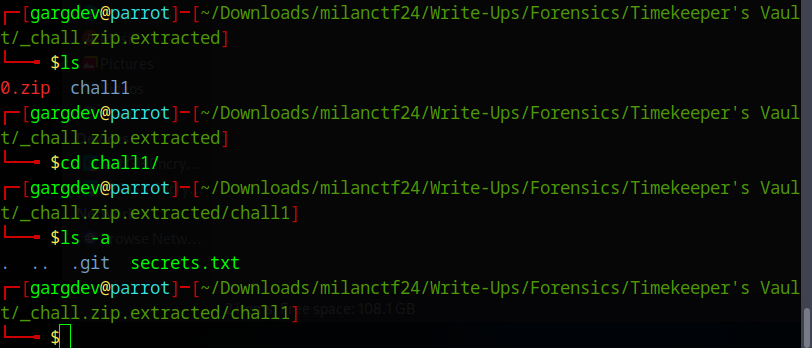
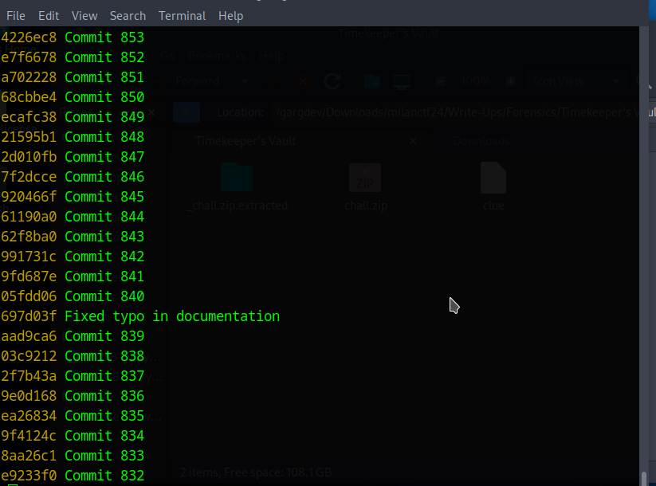
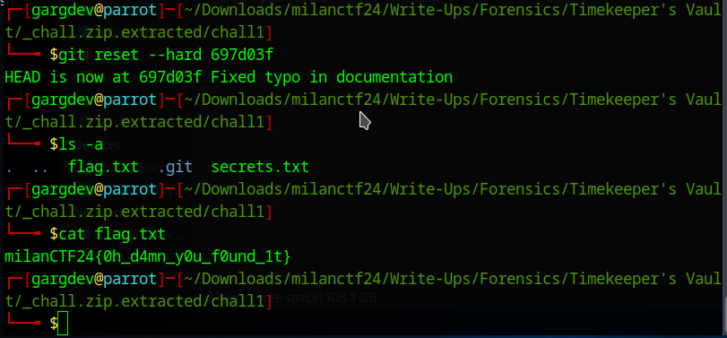

## Timekeeper's Vault

**Description:** A vault locked in time, its secrets hidden in layers of history. Traverse the echoes of the past to find the key moment. Restore the balance, and the flag shall be yours.

**Attachment:** chall.zip

## Required Knowledge
 - git
 - how to extract zip files

## Solution
1. First we extract the `chall.zip` file we're provided with. Upon extracting we see a directory named `chall1` inside it. Upon examining that directory, we can confirm that it's a git directory.

   

2. From the image we can see that this directory contains a text file named `secrets.txt`. But from the description we know that we have to find the key moment from the past that means a previous commit that was overwritten by other commits. So we do `git log --oneline` to get 1 line description for all the commits.

   

3. All the commits were named pretty uniformly as *Commit number* but one, so it was easy to find the suspicious commit or the key moment in the past. Now we can just hard reset our directory to this commit.

   

4. After resetting to that commit, we can see there appears a flag.txt file in our directory. It contains the flag.

## Flag

`milanCTF24{0h_d4mn_y0u_f0und_1t}`
