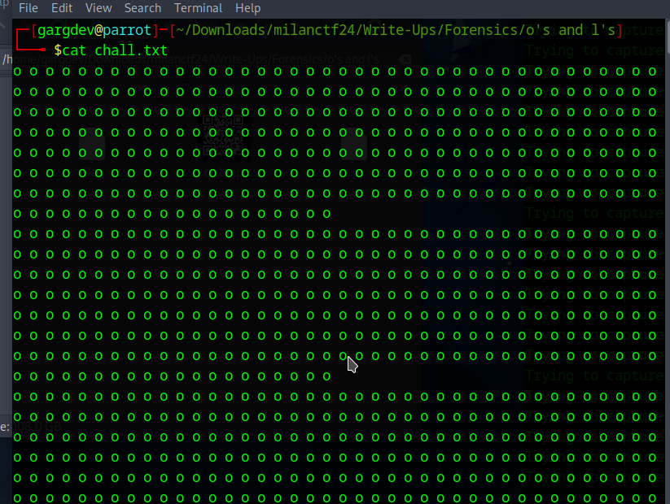
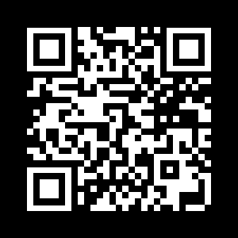

## o's and l's

**Description:** Someone just left a huge bunch of o's and l's in a text file and sent it to us. Can you figure out why?

**Attachment:** chall.txt

## Required Knowledge
 - File handling with Python
 - Image manipulation with python

## Solution
1. We have a file named `chall.txt` that only contains *o's* and *l's*. Looking closely *o* looks similar to *0* and *l* looks similar to *1*. From this we can deduce that it is some kind of data stored in matrix of 0s and 1s. But what could it be? Well, our best bet is an image file, so we'll start with that.

   

2. We created a [python script](create_image.py) to read the `chall.txt` file and convert it to matrices of 0s and 1s and then store it as an image. The image we get is a **QR**.

   

3. Upon scanning the **QR**, we get the flag.

## Flag

`milanCTF{g0774_c47ch_7h0s3_qrs_97214}`
