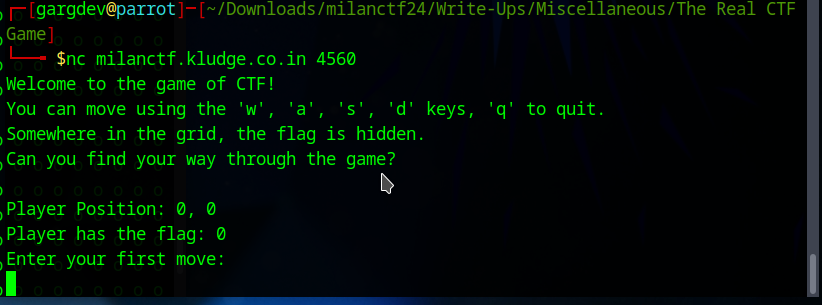
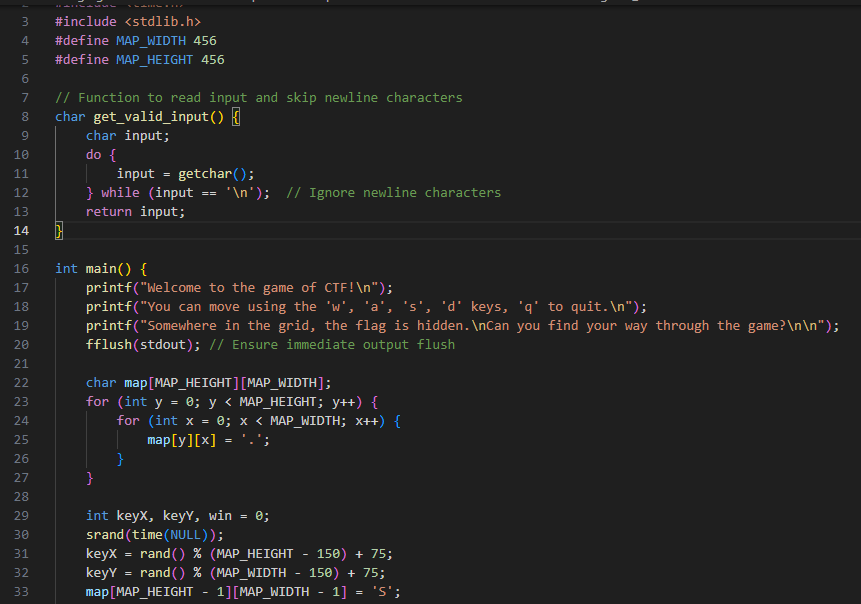
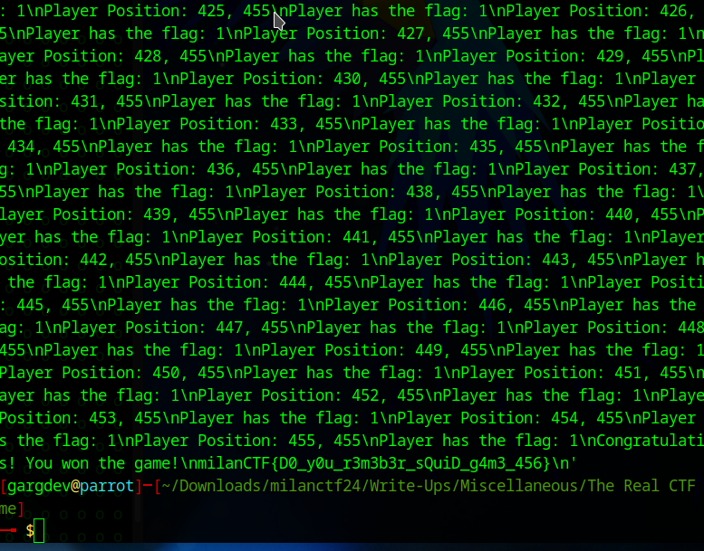

## The Real CTF Game
**Description:** So, I guess this challenge will end your long quest to find out where CTF got its name from :P

*netcat milanctf.kludge.co.in 4560*

## Required Knowledge
 - Basic C
 - Basic python (for the automation script)
 - pwntools
 - netcat

## Solution
1. First we connect to the server and check what it does as shown.
   
   

2. We can see that it requires us to input movement instructions. Now we'll take a look at the source code that we've been provided with.

   

3. From the code, we can see that the maximum possible value for both `keyX` and `keyY` is 380. It means we need to check every possible location (x, y) where 0 <= x, y <= 380. So we can try to automate this process using `pwntools` as it would be tedious doing it manually.

4.  So we write the [realCTF](realCTF.py) script to automate this process. And when we run it, we can see the outputs in the terminal. We'll have to wait for 20-30 mins to complete the process as the grid space is large.

   

5. As we can see in the image, we have captured the flag at the end.

## Flag

`milanCTF{D0_y0u_r3m3b3r_sQuiD_g4m3_456}`
