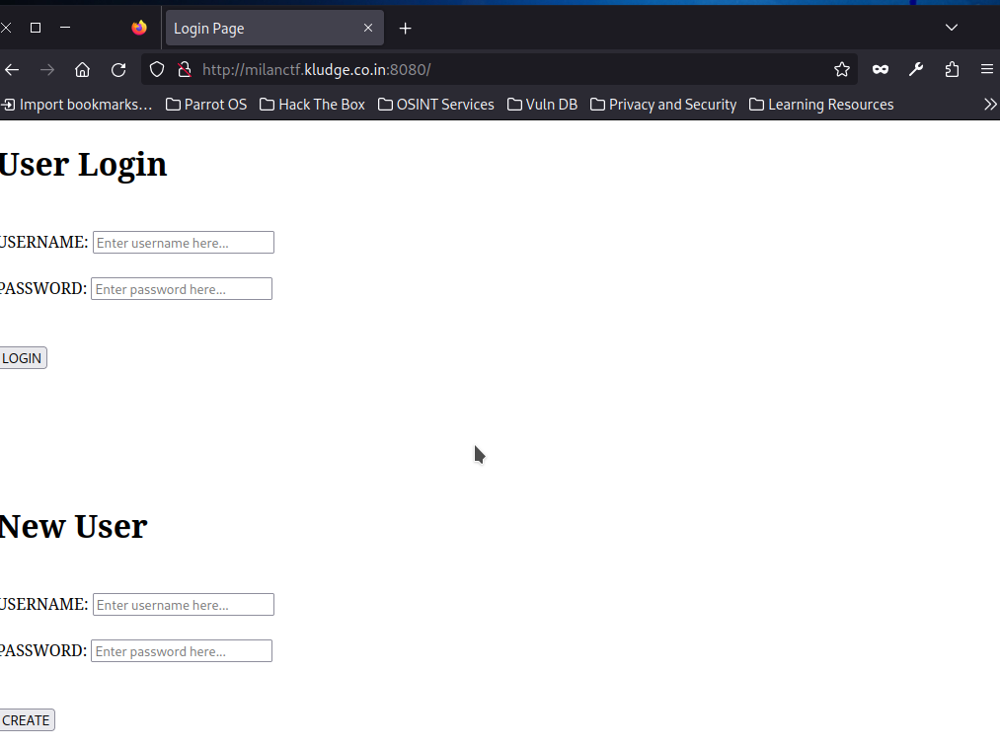
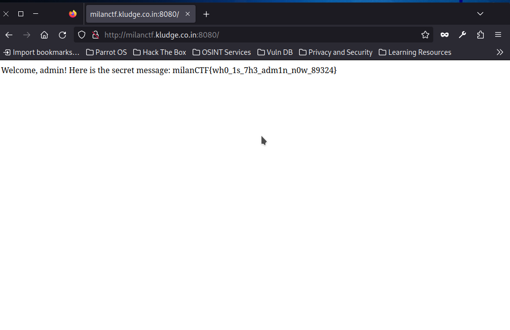

## Undercover
**Description:** One of our undercover agents has figured out that an elite organisation is sending secret messages to its favoured clients on their recently launched public user website. The messages can be accessed only by those with the password to the user with name - admin. It is your task to figure out the latest message shared by the organisation.

**Website:** milanctf.kludge.co.in:8080

## Required Knowledge
 - basic SQL
 - SQL injections

## Solution
1. First, we'll open the website. This is what it looks like
   
   

2. From the image, we can see that there are two options - either *login to an existing user* or *create a new user*. As the challenge description says, the messages can only be accessed by those with the password to the user with name - admin. This means that we've to login as admin, but what to do? We don't know the password. So we'll try doing an SQL injection here. We'll use
   ```
   user = admin
   password = ' or 1=1; --
   ```

3. And this was enough to exploit this website as we can see from the image, we've obtained our flag.

   

## Flag

`milanCTF{wh0_1s_7h3_adm1n_n0w_89324}`
